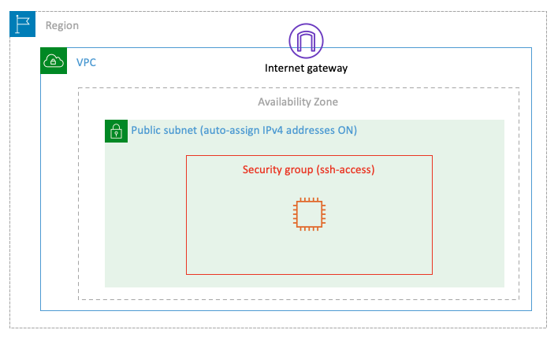
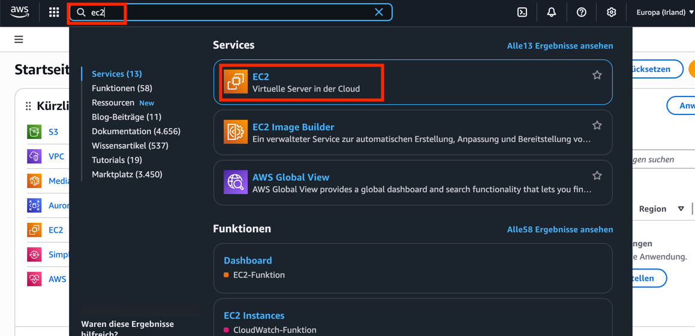
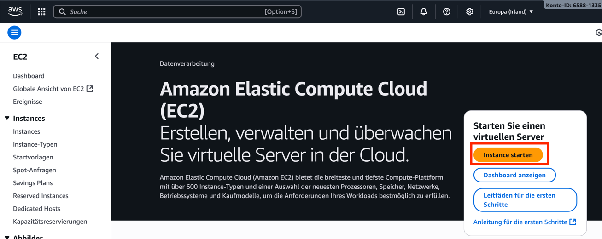
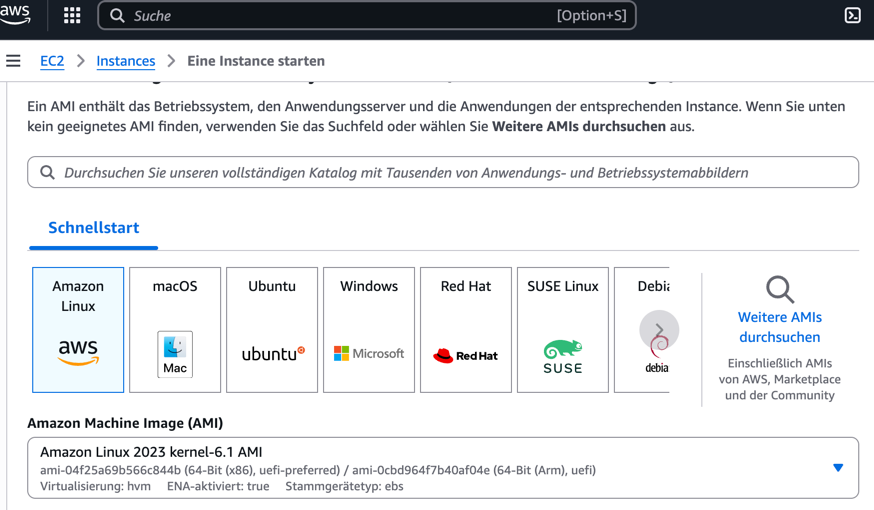
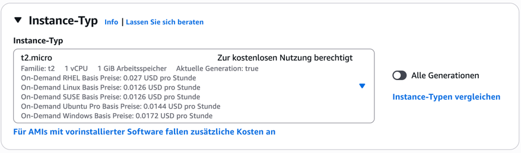
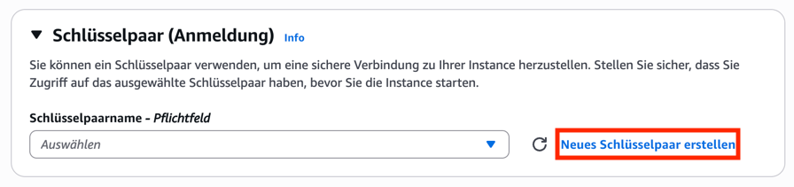
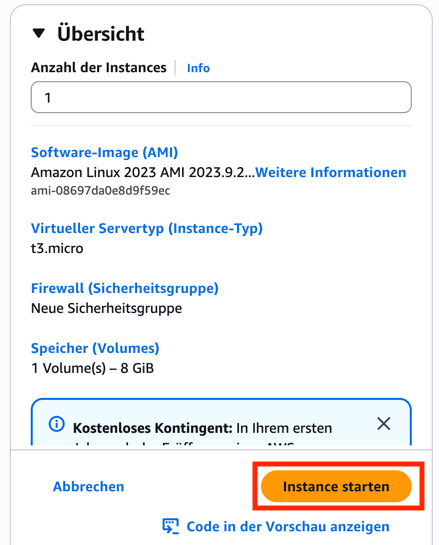
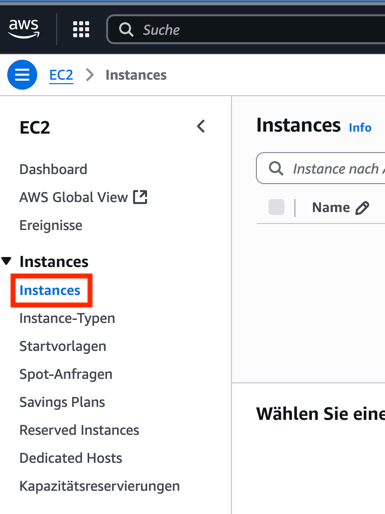
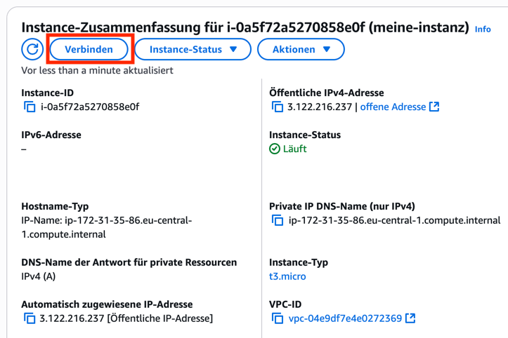
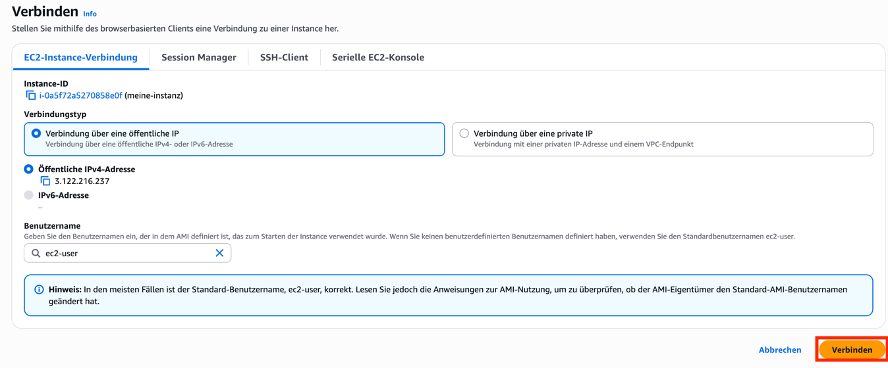

# Eine einzelne EC2-Instanz erstellen

Das Ziel dieses Labs ist es, eine einzelne EC2-Instanz in einem öffentlichen
Subnetz zu starten, die über das Internet per SSH erreichbar ist.

Los geht’s! Klicken Sie oben links auf die Suchleiste, suchen Sie nach "ec2" und
wählen Sie den Dienst aus.

---

## AMI auswählen

Im EC2-Menü klicken Sie auf "Instanz starten".

Wählen Sie nun das Amazon Linux 2023 AMI aus. Ein AMI ist eine Vorlage, die die
Softwarekonfiguration (Betriebssystem, Applikationsserver und Anwendungen)
enthält, die zum Starten Ihrer Instanz erforderlich ist. In diesem ersten Lab
bleiben wir bei der x86-Architektur.

---

## Instanztyp festlegen

Der Instanztyp definiert CPU- und Speicherressourcen. Außerdem legt er die
unterstützte Speicherarchitektur und die verfügbare Netzwerkleistung fest. Sie
können den vorgeschlagenen Instanztyp verwenden.

---

## Schlüsselpaar erstellen

Sie benötigen ein Schlüsselpaar, um später auf die EC2-Instanz zugreifen zu
können.

Vergeben Sie einen Namen und erstellen Sie das Schlüsselpaar. Es wird daraufhin
heruntergeladen.

---

## Security Group

Die Security Group ist eine Firewall für die Instanz. Die Voreinstellung ist,
eine neue Security Group anzulegen, die Zugriff über Port 22 (SSH) aus dem
Internet erlaubt. Das ist zwar nicht sicher, aber für das Lab die richtige Wahl.

## Netzwerkeinstellungen

Hier können Sie alle Einstellungen auf den Standardwerten lassen – insbesondere
"Öffentliche IP automatisch zuweisen".

---

## Speichereinstellungen

Hier können Sie die Standardwerte übernehmen.

---

## Tags

Tags sind eine Möglichkeit, AWS-Ressourcen mit Textmetadaten zu versehen, um
Ihre Cloud-Umgebung besser zu verwalten. Für dieses Lab können Sie diesen
Schritt überspringen.

---

## Instanz starten

Klicken Sie als Letztes auf "Instanz starten."

Klicken Sie auf "Instances" im Menü links, um zur EC2-Konsole zurückzukehren.
Dort sehen Sie eine Liste aller vorhandenen Instanzen – einschließlich der neu
erstellten Instanz.

---

## Test & Validierung

Sobald Ihre Instanz läuft, wähle Sie in der EC2-Konsole aus und klicken Sie auf
"Verbinden".

Nun können Sie sich direkt im Browser mit der Instanz verbinden.

