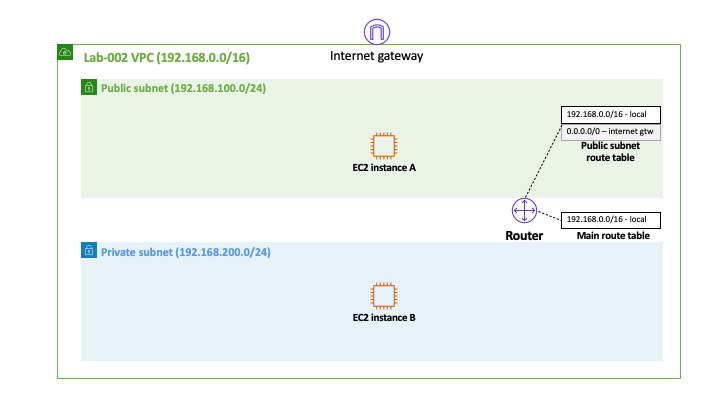
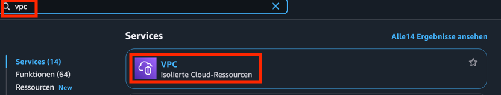
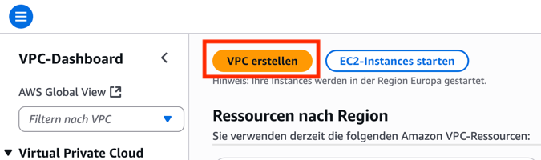
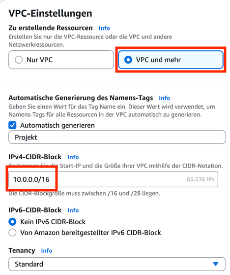
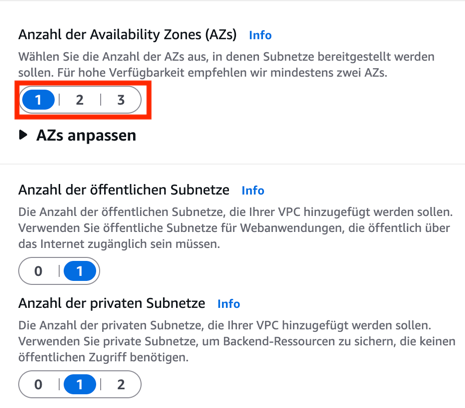
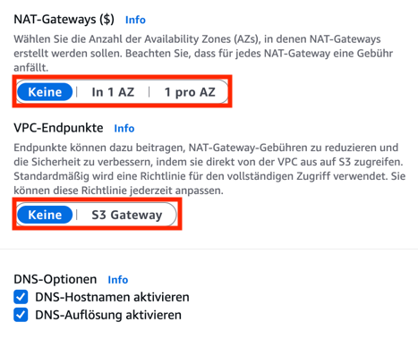
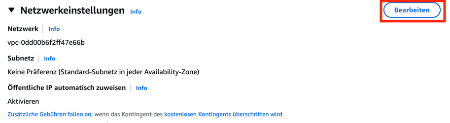
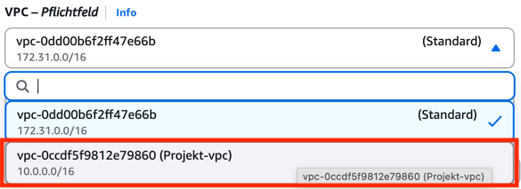
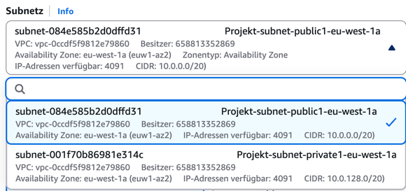
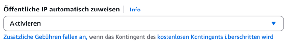

# Übung 2: EC2-Instanz in einem privaten Subnetz mit Bastion Host

In dieser Übungsaufgabe lernen wir, wie man eine VPC mit Subnetzen erstellt.
Anschließend sehen wir, wie man eine EC2-Instanz in einem privaten Subnetz über
einen Bastion Host erreichbar machen kann.



## Schritt 1: VPC anlegen

Navigieren Sie als Erstes in die VPC-Konsole, indem sie in die Suchleiste oben
"VPC" eingeben und den ersten Treffer auswählen.



Klicken Sie danach auf den Knopf, um eine VPC zu erstellen.



AWS bietet inzwischen einen komfortablen Wizard an, um VPCs zu erstellen. Sie
können fast alle Einstellungen bei den Standardwerten lassen. Durch die Option
"VPC und mehr" werden direkt Subnetze für die VPC angelegt. Den CIDR-Block
können sie so belassen – merken Sie ihn sich aber. Für die automatisch
generierten Namens-Tags können Sie den Standard "Projekt" belassen oder einen
eigenen wählen wie "MeineVPC".



Im Anschluss stellen Sie der Übersicht halber die Anzahl der AZs auf 1. Dadurch
wird nur je ein privates und öffentliches Subnetz angelegt.



Wir benötigen zunächst wuch weder NAT-Gateways noch VPC-Endpunkte.



Sie können die VPC nun anlegen und den Wizard damit abschließen.

## Schritt 2: EC2-Instanzen starten

Starten Sie in jedem der beiden Subnetze jeweils eine EC2-Instanz wie in
Aufgabe 1. Um eine VPC und ein Subnetz auszuwählen, müssen Sie im
Netzwerkdialog zunächst auf "Bearbeiten" klicken.



Wählen Sie danach zuerst die richtige VPC.



Und dann für die erste EC2-Instanz das private Subnetz und für die zweite
Instanz das zweite Subnetz.



Für die Instanz im öffentlichen Subnetz muss darüber hinaus noch die Vergabe
einer öffentlichen IP aktiviert werden.



Denken Sie bitte daran, das richtige Key Pair zu verwenden. Sonst können Sie
sich anschließend nicht mit den Instanzen verbinden.

## Schritt 3: Test

Verbinden Sie sich wie in Aufgabe 1 per SSH mit der Instanz im öffentlichen
Subnetz. Nun müssen Sie Ihren Key auf die Instanz bringen, damit Sie sich weiter
mit der privaten Instanz verbinden können. Das können Sie beispielsweise tun,
indem Sie den Texteditor `nano` verwenden und den Inhalt der `.pem`-Datei
einfügen. Nennen Sie die Schlüsseldatei `key.pem`.

Vergeben Sie die korrekten Dateiberechtigungen für die Schlüsseldatei, damit
sich `ssh` nicht beschwert:

```bash
chmod 0700 key.pem
```

Sobald der Schlüssel auf der Instanz ist, können Sie sich mit der privaten
Instanz verbinden:

```bash
ssh -i key.pem ip-der-privaten-ec2-instanz
```

z.B.

```bash
ssh -i key.pem ec2-user@10.0.130.61
```

> Profis können natürlich auch einfach vom eigenen Rechner mittels
> SSH-Agent-Forwarding vom Bastion-Host zur privaten Instanz springen.

## Ausblick

Bevor Sie nun aufräumen, versuchen Sie, mit `ping` einen Server im Internet zu
erreichen.

```bash
[ec2-user@ip-10-0-143-240 ~]$ ping www.google.de
PING www.google.de (216.58.206.35) 56(84) bytes of data.
```

Es fällt auf, dass keine Verbindung zum Internet möglich ist von der privaten
Instanz. Dies wollen wir in der nächsten Aufgabe beheben.
