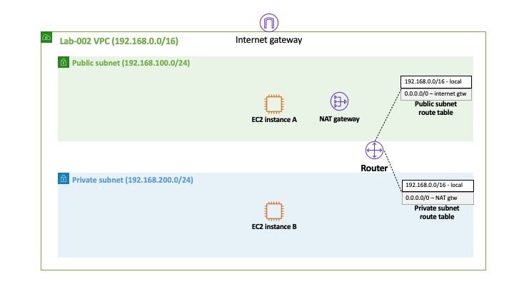
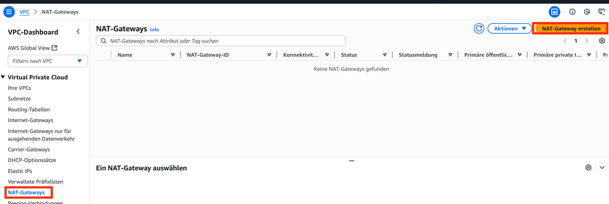
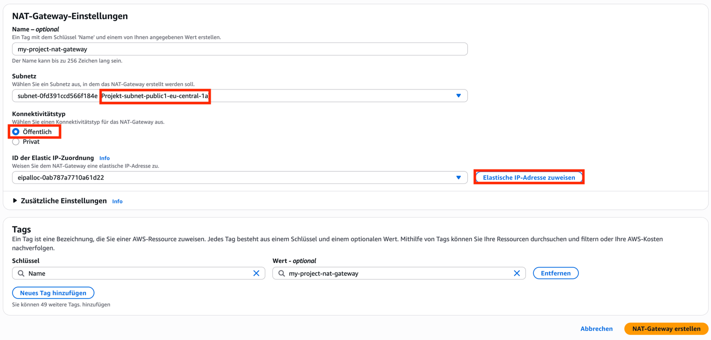
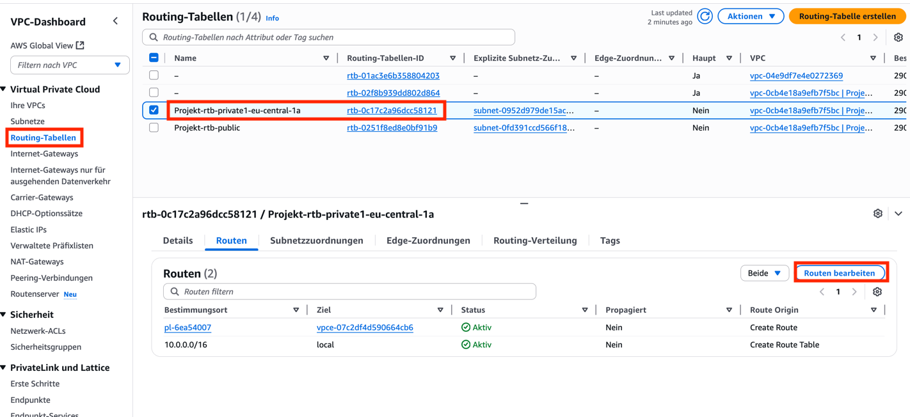

# NAT Gateways

Aufbauend auf die letzte Aufgabe wollen wir nun Instanzen im privaten Subnetz
Zugriff auf das Internet geben.

## Gateway anlegen

Begeben Sie sich zur VPC-Konsole und dort über das Menü zu "NAT Gateways".
Klicken Sie auf "NAT Gateway anlegen"

---

Wählen Sie als Subnetz das **öffentliche (public)** Subnetz, denn sonst kommt
das Gateway selbst nicht in das Internet. Legen Sie eine Elastic IP an über den
Knopf "elastische IP zuweisen" und wählen Sie den Konnektivitätstyp
"öffentlich". Nun können Sie das Anlegen abschließen.

## Routen aktualisieren

Damit die EC2-Instanzen im privaten Subnetz das neue Gateway auch nutzen, um in
das Internet zu kommen, müssen wir die Routen des Netzwerks anpassen. Gehen Sie
dafür in das Routing-Tabellen-Menü.

Legen Sie aber keine neue Tabelle an, sondern wählen Sie die Route-Table für das
private Subnetz Ihrer VPC aus. Wenn Sie die Routing-Tabelle angeklickt haben,
klicken Sie auf "Routen bearbeiten".

---

Fügen Sie eine neue Regel hinzu für das Ziel `0.0.0.0/0`. Wählen Sie als Typ
"NAT-Gateway" und wählen Sie das soeben angelegte Gateway aus. Warten Sie nun
2-3 Minuten, bis das Gateway fertig eingerichtet ist.

Verbinden Sie sich wieder mit Ihrer privaten Instanz aus Aufgabe 2 und
wiederholen Sie den Test. Sie sollten nun Server im Internet erreichen können.
