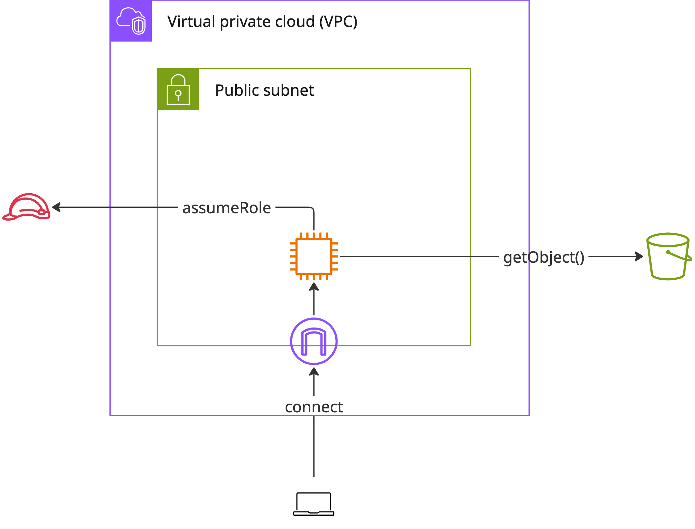
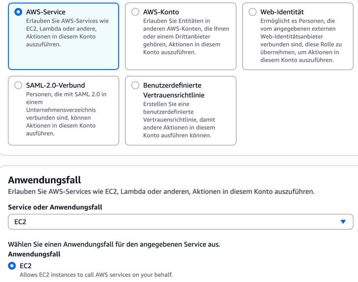
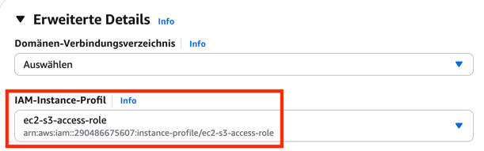

# Instance Profiles

EC2-Instanzen benötigen eine IAM-Rolle, um auf andere AWS-Ressourcen zugreifen
zu können. Eine solche Rolle wird Instanzprofil oder **Instance Profile**
genannt. Wir wollen uns dies am Beispiel von AWS S3 anschauen.

## Bucket und Rolle anlegen

Legen Sie zuerst einen S3-Bucket an. Erstellen Sie dann eine IAM-Rolle mit einer
Vertrauensbeziehung zu EC2-Instanzen.

Die Rolle soll Vollzugriff auf den Bucket gewähren, den Sie erstellt haben.

## EC2-Instanz anlegen

Erstellen Sie eine EC2-Instanz mit folgenden Eigenschaften (dies entspricht
Aufgabe 01):

- In einem öffentlichen (*public*) Subnetz
- Öffentliche IP automatisch zuweisen
- AMI mit Amazon Linux 2023
- t2.micro oder t3.micro
- Besitzt eine Security Group, die Zugriff auf Port 22 erlaubt

Darüber hinaus wollen wir der Instanz aber auch die oben erstellte Rolle
übergeben. Dies geht unter den erweiterten Einstellungen

Schließen Sie nun den Start der Instanz ab.

## Test

Verbinden Sie sich anschließend per SSH mit der Instanz wie in Aufgabe 1.
Benutzen Sie dann das aws-CLI, um zu testen, ob Sie Dateien zum S3-Bucket
hochladen können. Dies sollte nun funktionieren, weil Sie der EC2-Instanz über
die Rolle dazu das Recht vergeben haben.

## Rolle trennen

Man kann die IAM-Rolle einer Instanz nachträglich ändern oder auch komplett
entfernen. Wählen Sie dazu die Instanz in der Liste aus und gehen durch das
Aktionsmenü über "Sicherheit" zu "IAM-Rolle ändern". In dem folgenden Menü
wählen Sie "Keine IAM-Rolle" aus und aktualisieren die Einstellungen. Wenn Sie
nun in der SSH-Sitzung versuchen, auf S3 zuzugreifen, wird die Anfrage
fehlschlagen.
