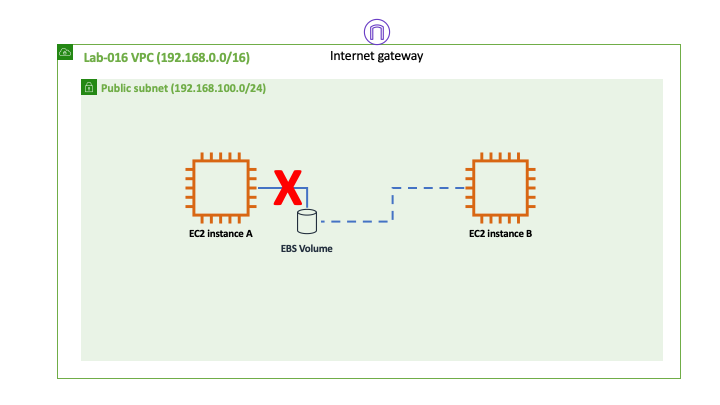
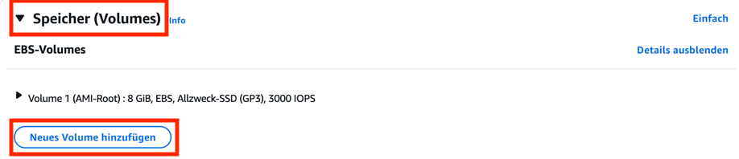
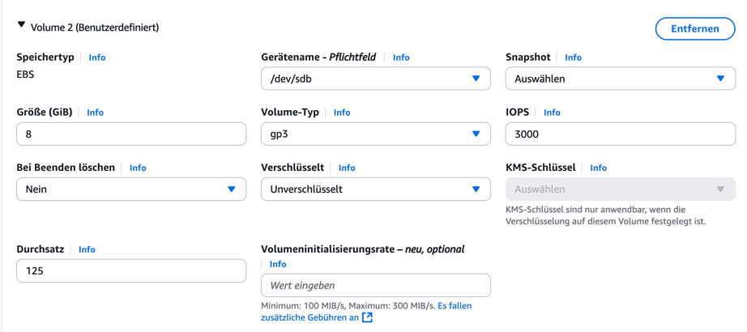
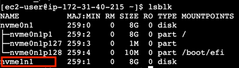
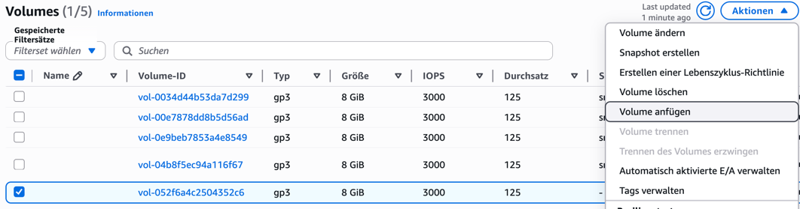

# Arbeit mit EBS-Volumes

In dieser Aufgabe legen wir eine EC2-Instanz mit einer persistenten
Cloudfestplatte an, einem sogenannten EBS-Volume. Daraufhin werden wir die
Instanz löschen, nicht aber das Volume. Danach hängen wir es an eine neue
Instanz an.



## Instanz starten

Erzeugen Sie eine Instanz mit folgenden Eigenschaften (dies entspricht
Aufgabe 01)

- In einem öffentlichen (*public*) Subnetz
- Öffentliche IP automatisch zuweisen
- AMI mit Amazon Linux 2023
- t2.micro oder t3.micro
- Besitzt eine Security Group, die Zugriff auf Port 22 erlaubt

Dieses Mal konfigurieren Sie aber noch zusätzlich Storage für die Instanz.
Erzeugen Sie dazu im Speicher-Menü ein neues Volume.



Sie können alle Einstellungen auf den Standards belassen. Beachten Sie, dass
anders als beim bereits vorhandenen Volume (dem sogenannten Startvolume) die
Einstellung "Beim Beenden löschen" auf "nein" steht. Das bedeutet, dass dieses
neue Volume bestehen bleiben wird, wenn die Instanz gelöscht wird.



## Volume formatieren und mounten

Verbinden Sie sich nun per ssh mit der neuen Instanz. Führen Sie den
Linux-Befehl `lsblk` aus, um sich alle verbundenen Blockspeicher anzeigen zu
lassen. Der letzte Eintrag in der Liste wird üblicherweise das zusätzliche
EBS-Volume sein. Wie benötigen den Namen. Im Beispiel unten ist dies `nvme1n1`



Formatieren Sie nun das Volume mit dem Dateisystem `ext4` und mounten Sie es auf
das Verzeichnis `/data` mit den folgenden Befehlen:

```bash
sudo mkfs.ext4 /dev/nvme1n1
mkdir data
sudo mount /dev/nvme1n1 data
```

Ersetzen Sie dabei gegebenenfalls `nvme1n1` durch den Namen des Blockgeräts, den
Sie oben ermittelt haben. Zuletzt schreiben wir noch ein paar leere Testdateien.

```bash
sudo touch data/test1.txt
sudo touch data/test2.txt
sudo touch data/test3.txt
```

## EC2-Instanz beenden (löschen)

Beenden Sie nun die EC2-Instanz. Das zusätzliche Volume bleibt bestehen und
wird im nächsten Schritt wieder verwendet.

## EBS-Volume in neue Instanz einhängen

Erzeugen Sie eine neue EC2-Instanz wie in Aufgabe 1. Hängen Sie erst mal kein
weiteres EBS-Volume beim Erstellen der Instanz an.

Gehen Sie nun in das "Volumes"-Menü und wählen Sie das EBS-Volume aus, welches
in der letzten Aufgabe erzeugt wurde.

> Wenn Sie sich unsicher sind, welches dies ist: In der Tabelle gibt es eine
> Spalte "Volume-Status". Wir suchen das Volume, welches "Verfügbar" ist

Klicken Sie nun auf "Aktionen" und dann auf "Volume anfügen"



Wählen Sie die korrekte Instanz aus und hängen Sie das Volume unter `/dev/sdb`
ein.

## EBS-Volume in der neuen Instanz mounten

Verbinden Sie sich nun per SSH mit der neuen Instanz. Gehen Sie vor wie oben für
das Mounten des Volumes: nutzen Sie `lsblk` um den Namen des Volumes zu
ermitteln und mounten Sie es danach mit `mount`.


```bash
mkdir data
sudo mount /dev/sdb data
ls data
```

Innerhalb des Verzeichnisses `data` erscheinen nun alle Testdateien, die wir
zuvor angelegt haben. Das Volume hat also die Terminierung der alten Instanz
überlebt.
