# Auto Scaling Group und Load Balancer erstellen

In dieser Übungsaufgabe erstellen wir eine VPC über 2 Availability Zones, eine Auto Scaling Group sowie einen Load Balancer.

## VPC erstellen

Erstellen Sie wie in der vorletzten Aufgabe eine VPC – dieses Mal aber über 2 AZs.
Nennen Sie die VPC "Webserver".

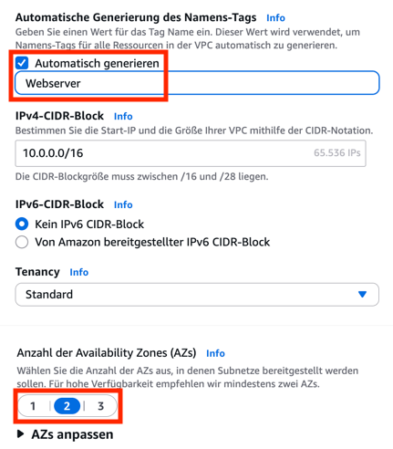

## Startvorlage erstellen

Gehen Sie in der EC2-Webkonsole in das Startvorlagen-Menü.

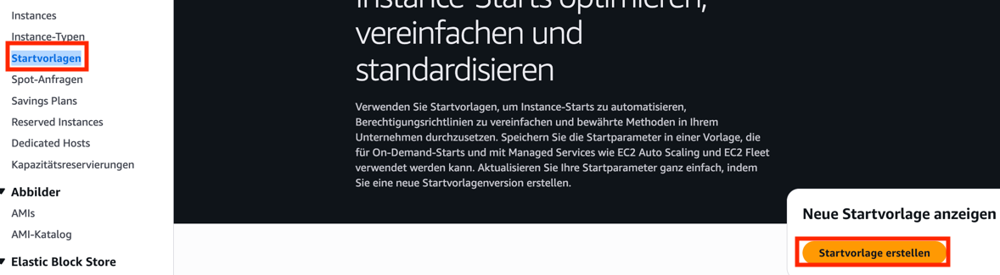

---

Benennen Sie das Template und aktivieren Sie die Anleitung zur Einrichtung für Auto Scaling.

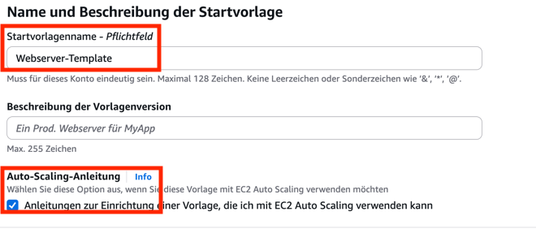

---

Wählen Sie Amazon Linux 2023 als AMI und t3.micro als Instance Type.

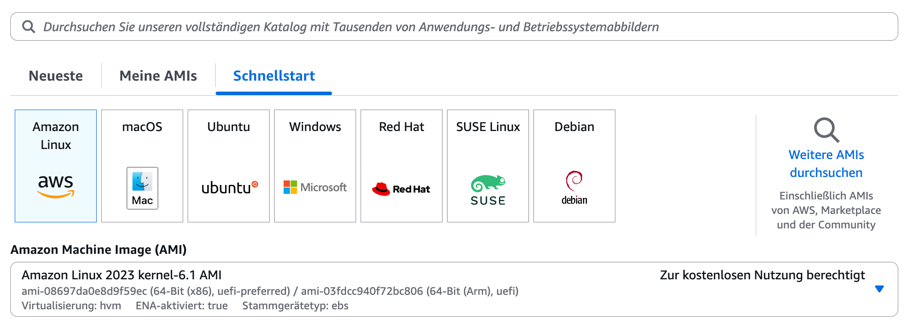
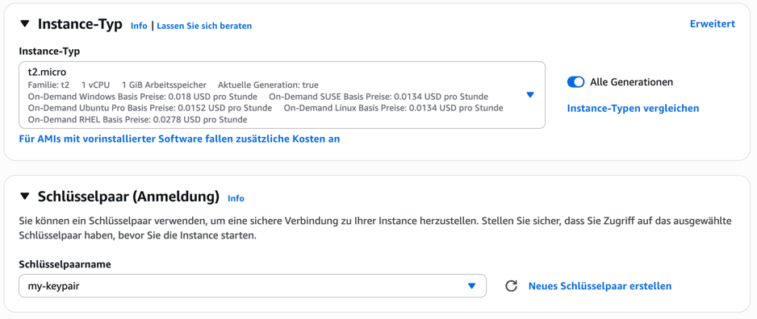

---

Nehmen Sie in den Netzwerkeinstellungen kein Subnetz auf. Legen Sie aber eine Sicherheitsgruppe an, für die Sie die VPC "Webserver" auswählen.

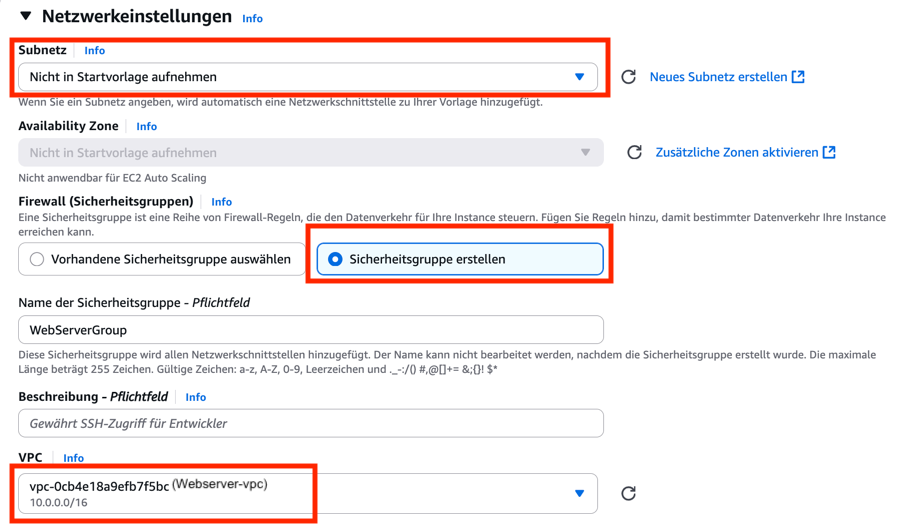

---

Richten Sie eine Regel ein, die auf Port 80 Traffic von jeder Quelle erlaubt.
Nennen Sie die Sicherheitsgruppe "Webserver".
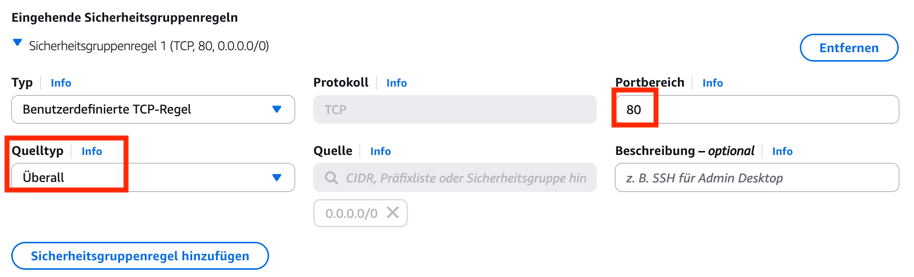

---

Aktivieren Sie in den erweiterten Netzwerkeinstellungen die automatische Vergabe einer öffentlichen IP.
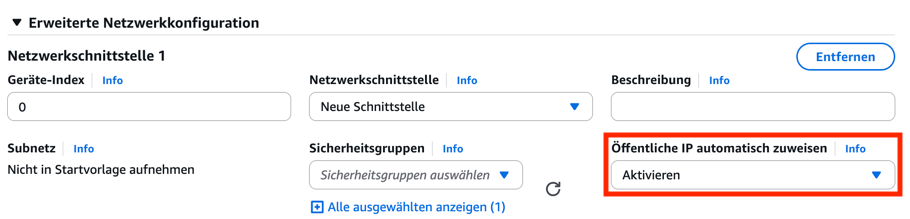

---

In den erweiterten Einstellungen ganz unten benötigen wir ein Benutzerdaten-Skript.

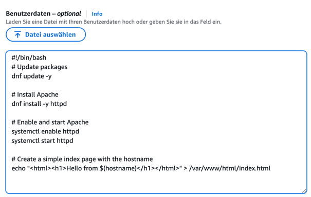

```bash
#!/bin/bash
# Update packages
dnf update -y

# Install Apache
dnf install -y httpd

# Enable and start Apache
systemctl enable httpd
systemctl start httpd

# Create a simple index page with the hostname
echo "<html><h1>Hello from $(hostname)</h1></html>" > /var/www/html/index.html
```

Sie können nun das Anlegen der Vorlage abschließen.

## Auto Scaling Group und Load Balancer erstellen 

Gehen Sie in der EC2-Webkonsole in das Auto Scaling-Menü.

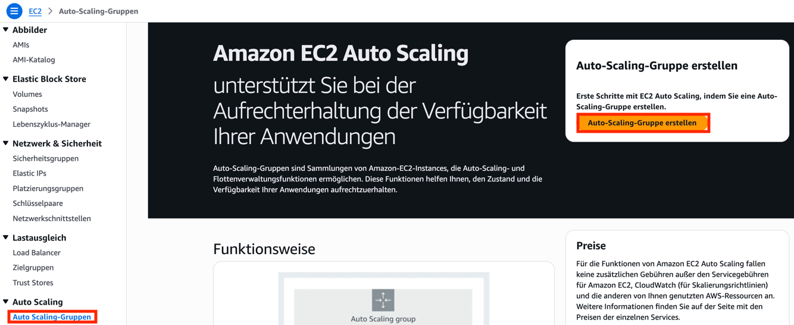

---

Vergeben Sie einen Namen und wählen Sie die oben erstellte Startvorlage aus.

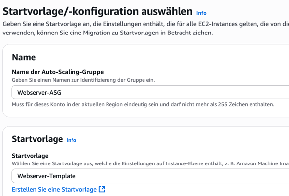

Gehen Sie nun zum nächsten Schritt.

---

Wählen Sie die Webserver-VPC aus und weiter unten die beiden öffentlichen Subnetze.

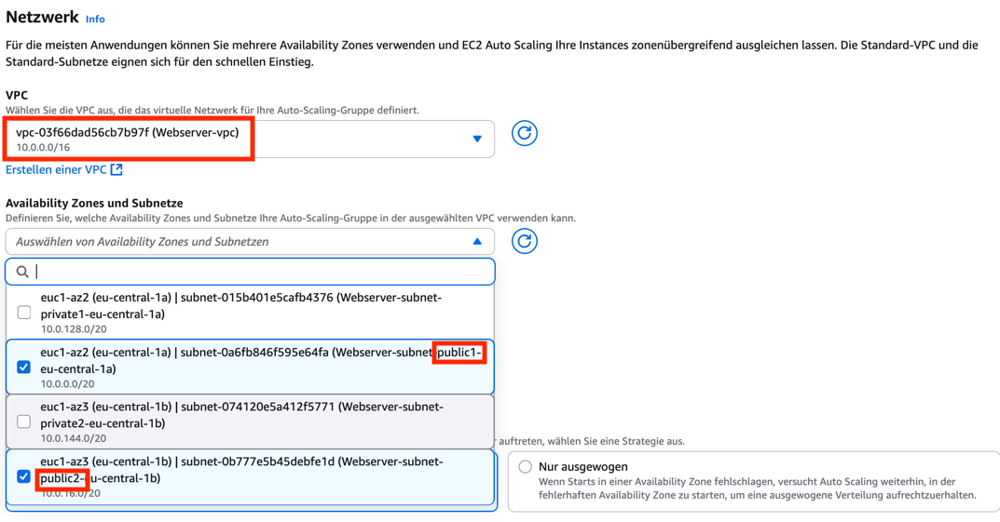

Gehen Sie nun zum nächsten Schritt.

---

Wählen Sie die Option, einen neuen Loadbalancer zu erstellen. Als Typ wählen Sie "Application Load Balancer", als Schema "Internet Facing".

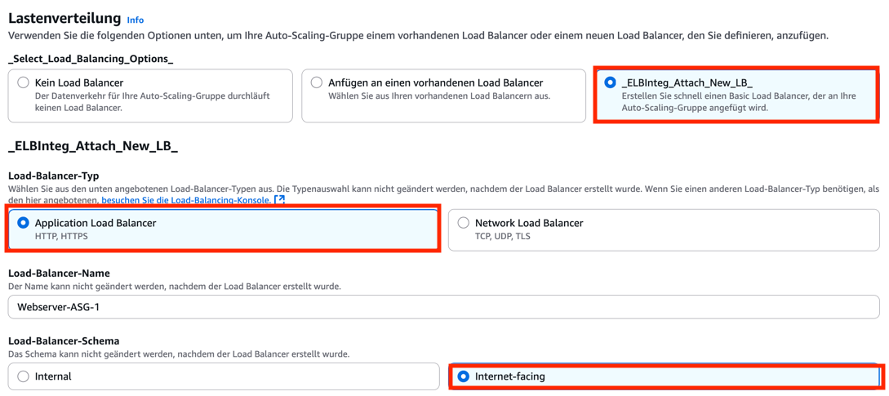

Erzeugen Sie weiter unten eine neue Zielgruppe für den neuen Load Balancer.

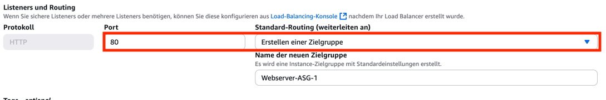

Gehen Sie nun zum nächsten Schritt.

---

Geben Sie als gewünschte Kapazität und gewünschte Mindestkapazität jeweils 2 ein.

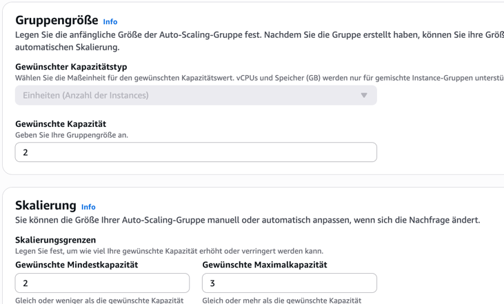

Sie können nun fortfahren, bis die Auto Scaling Group fertig angelegt ist.

## Security Group des Load Balancers anpassen

Gehen Sie in der EC2-Webkonsole in das Load Balancer-Menü. Wählen Sie den Loadbalancer aus und klicken Sie im Tab "Sicherheit" auf "Bearbeiten".

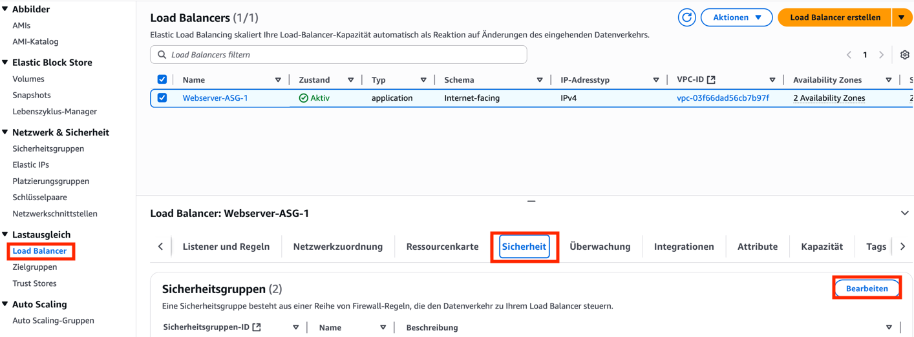

---

Nehmen Sie zu den Sicherheitsgruppen des Loadbalancers die Webserver-Sicherheitsgruppe hinzu.

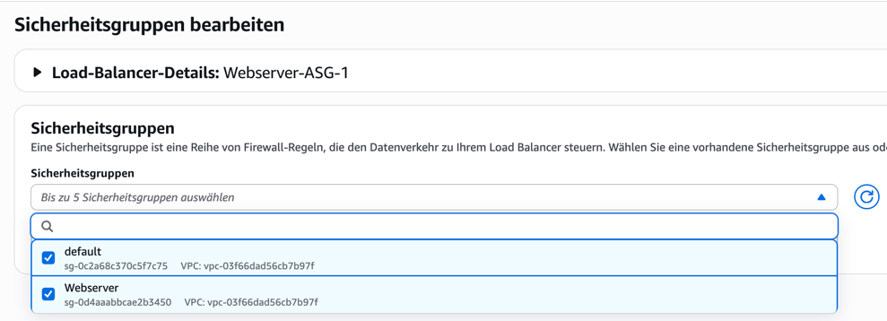

---

Zuletzt können Sie nun die URL des Load Balancer kopieren, wenn Sie in die Detailansicht gehen und DNS-Namen kopieren.

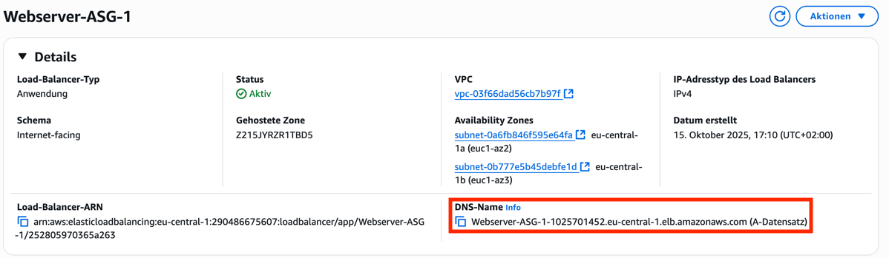

## Test

Rufen Sie die URL auf. Verwenden Sie dabei aber auf jeden Fall HTTP als Protokoll, **nicht** HTTPS!

