# Übungsaufgabe zum Elastic Container Service (ECS)

In dieser Aufgabe erstellen Sie einen ECS-Cluster und installieren darauf einen Fargate-Service mit dem NGINX-Webserver.

## Cluster anlegen

Gehen Sie in die Webkonsole für ECS und erstellen Sie einen neuen Cluster.

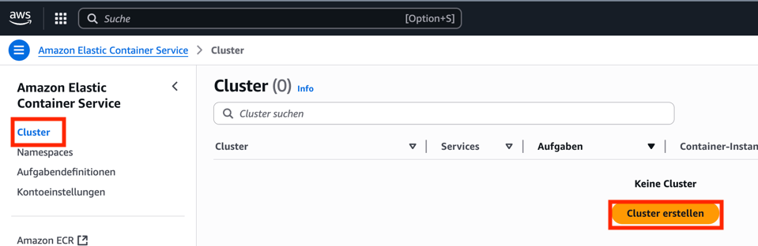

---

Vergeben Sie einen beliebigen Namen und wählen den Betriebsmodus "Fargate".

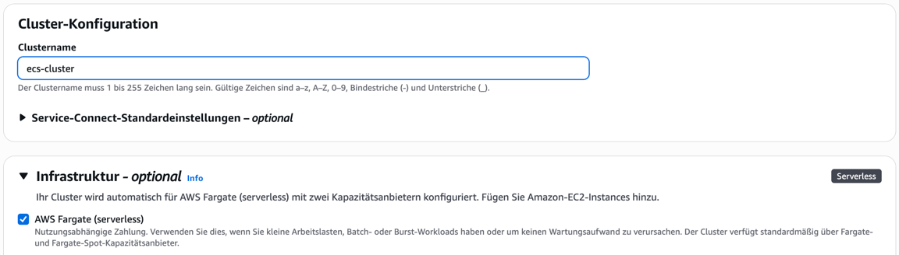

Aktivieren Sie außerdem Container Insights für mehr Logs und Metriken.

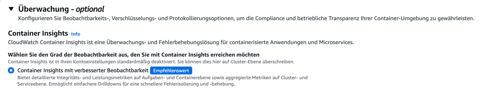

## Aufgabendefinition erstellen

Gehen Sie nun zurück in die Hauptseite der ECS-Webkonsole. Gehen Sie zu den Aufgabendefinitionen und legen Sie eine neue an.

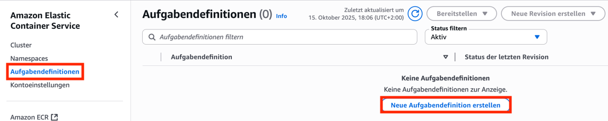

---

Vergeben Sie einen sinnvollen Namen und wählen Sie eine Kapazität von 0.25 vCPU und 0.5 GB.

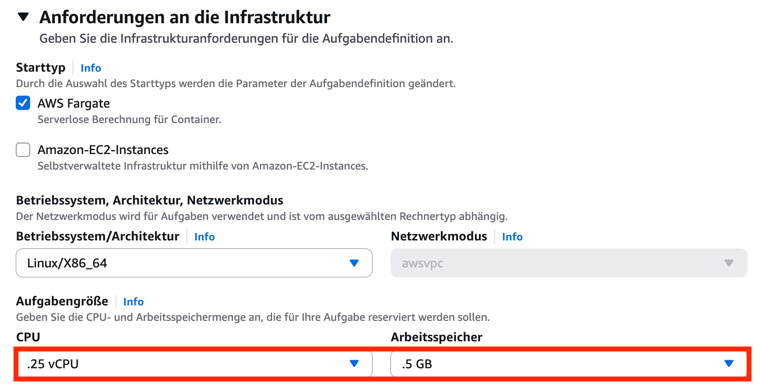

Als Container wählen Sie das Image `nginx:latest`.

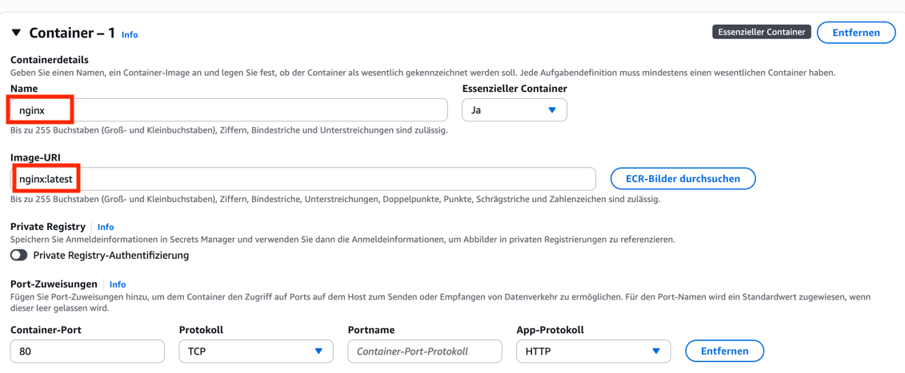

Schließen Sie nun die Erstellung der Aufgabendefinition ab.

## Service erstellen

Gehen Sie in die Detailansicht der neu angelegten Aufgabendefinition. Klicken Sie auf "Bereitstellen" und dann auf "Service erstellen".

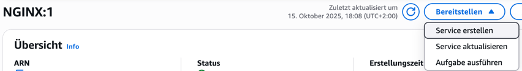

---

Vergeben Sie einen sinnvollen Namen. 

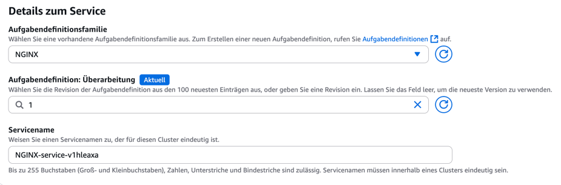

---

Wählen Sie eine VPC mit einem öffentlichen Subnetz. Wählen Sie daraufhin nur öffentliche Subnetze aus. Aktivieren Sie die öffentliche IP.

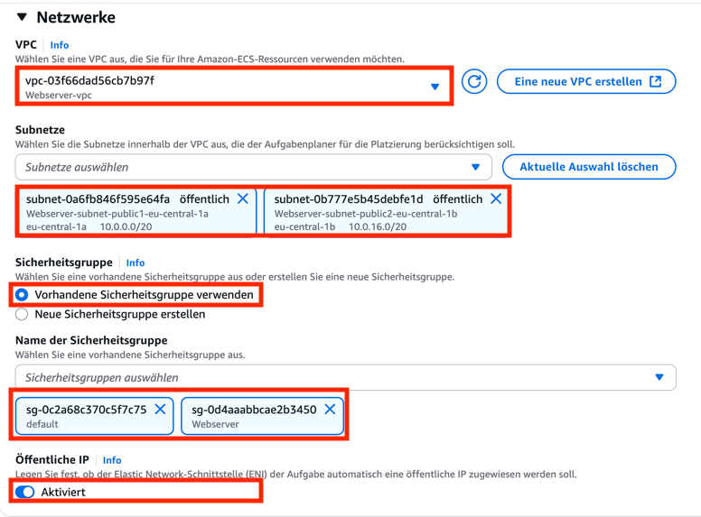

Schließen Sie nun das Anlegen des Services ab.

## Service testen

Gehen Sie zurück in die Clusterübersicht und wechseln Sie in den Tab "Aufgaben". Klicken Sie auf die Aufgabe, die der Service erzeugt hat.

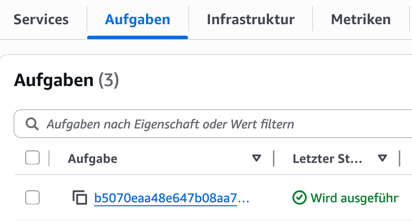

In der Detailansicht können Sie die öffentliche IP-Adresse verwenden, um den Service zu testen.

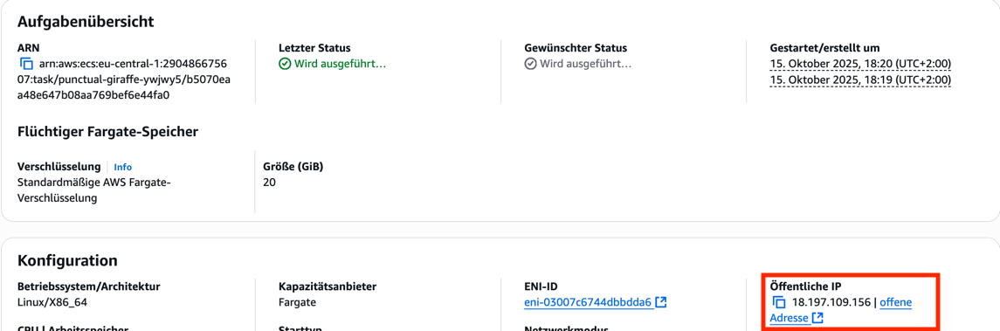