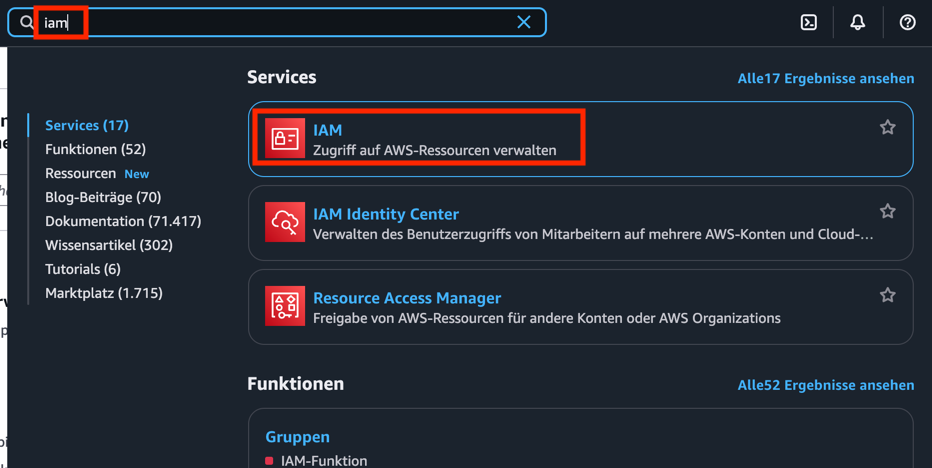
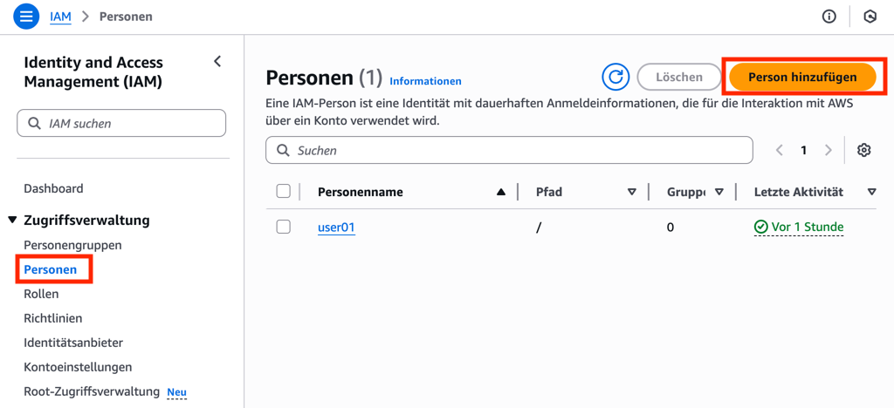
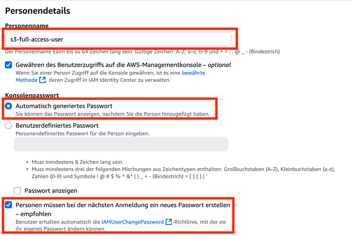
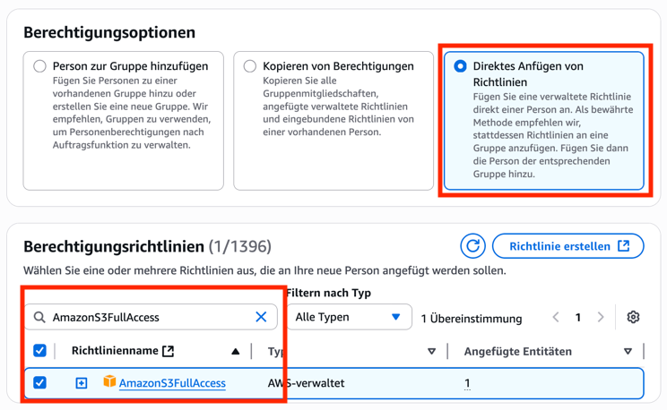
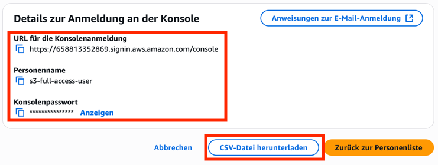
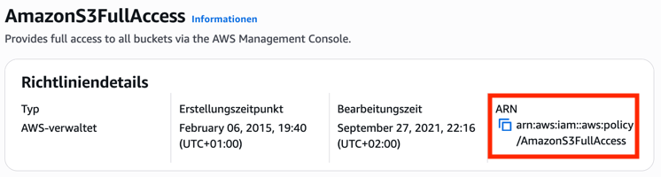
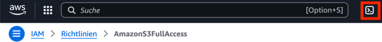

# Einführung in AWS IAM

Diese Übung führt Sie in die Grundlagen von AWS Identity and Access Management (IAM) ein. Sie lernen, wie Sie IAM-Benutzer erstellen, Berechtigungen über Policies zuweisen und den Zugriff testen, sowohl über die AWS Management Console als auch über die AWS Command Line Interface (CLI).

> In der Praxis wird heute empfohlen, statt IAM-Usern Rollen oder AWS IAM Identity Center (SSO) zu verwenden. Diese Übung nutzt IAM-User, da sie einfacher zu demonstrieren sind.

---

## Teil 1: IAM-Benutzererstellung über die AWS-Console
In diesem Teil erstellen Sie einen neuen IAM-Benutzer und weisen ihm eine Berechtigungs-Policy zu, die vollen Zugriff auf den AWS S3-Dienst ermöglicht.

Suchen Sie in der Suchleiste nach "IAM" und wählen Sie den Dienst aus.

Navigieren Sie im IAM-Dashboard zu "Personen" und klicken Sie auf "Personen hinzufügen".

Geben Sie dem Benutzer einen aussagekräftigen Namen, z.B. `s3-full-access-user`.
Aktivieren Sie "Gewähren des Benutzerzugriffs auf die AWS-Managementkonsole"
Wählen Sie "Automatisch generiertes Passwort" und lassen Sie "Personen müssen bei der nächsten Anmeldung ein neues Passwort erstellen" aktiv

Klicken Sie auf "Weiter".

Auf der Seite "Berechtigungen festlegen" wählen Sie "Direktes Anfügen von Richtlinien".
Suchen Sie nach der Policy `AmazonS3FullAccess` und wählen Sie diese aus.

Klicken Sie auf "Weiter".
Überprüfen Sie die Einstellungen und klicken Sie auf "Person hinzufügen".
Notieren Sie sich alle Benutzerinformationen und laden Sie sich zur Sicherheit die CSV mit den Anmeldeinformationen herunter!

## Test des S3-Zugriffs:

Öffnen Sie ein neues Inkognito-Fenster oder einen neuen Browser. Navigieren Sie zum IAM-Anmelde-Link, den Sie zuvor notiert haben. Melden Sie sich mit dem neu erstellten Benutzer (s3-full-access-user) und dem vergebenen Passwort an.
Suchen Sie in der Konsole nach "S3" und versuchen Sie, auf Ihre S3-Buckets zuzugreifen oder einen neuen Bucket zu erstellen.

--- 

## Teil 2: IAM-Benutzererstellung über die AWS CLI

In diesem Teil erstellen Sie einen weiteren IAM-Benutzer und weisen ihm Berechtigungen über die AWS CLI zu. Dies demonstriert die Automatisierungsmöglichkeiten von AWS.

### Vorbereitung in der Konsole
Melden Sie sich in der AWS Management Console wieder mit Ihrem Administrator-Benutzer an.
Navigieren Sie zu IAM und dann zu "Richtlinien". Suchen Sie nach der `AmazonS3FullAccess`-Policy und notieren Sie sich den ARN (Amazon Resource Name) dieser Policy. Dieser wird später für die CLI benötigt.

### Benutzererstellung über die AWS CLI
Öffnen Sie die CloudShell, indem Sie auf das Shell-Icon rechts neben der Suchleiste klicken.

Verwenden Sie `aws iam create-user` um einen neuen Benutzer zu erstellen. Der Benutzername wird mit `--user-name` angegeben.
Nach der Erstellung des Benutzers müssen Sie ein Login-Profil für die Konsole erstellen, falls der Benutzer sich auch über die Konsole anmelden soll. Hierfür wird `aws iam create-login-profile` verwendet, wobei `--user-name` und `--password` die wichtigsten Parameter sind. Achten Sie auf sichere Passwörter!

> [!tip]
> Um die erstellten Benutzer zu überprüfen, können Sie `aws iam list-users` verwenden.

### Zuweisung der S3-Policy über die AWS CLI
Um eine Policy an einen Benutzer anzuhängen, nutzen Sie den Befehl `aws iam attach-user-policy`. Sie benötigen den `--user-name` und den `--policy-arn`, den Sie in Schritt 1 notiert haben.

### Test des S3-Zugriffs:
Öffnen Sie erneut ein neues Inkognito-Fenster oder einen neuen Browser.
Melden Sie sich mit dem neu erstellten Benutzer (`s3-fullaccess-cli`) und dem vergebenen Passwort an der AWS Management Console an. Suchen Sie in der Konsole nach "S3" und versuchen Sie, auf Ihre S3-Buckets zuzugreifen oder einen neuen Bucket zu erstellen.

--- 

## Zusatzaufgabe
Versuchen Sie, eine eigene, restriktivere S3-Policy zu erstellen, die dem Benutzer nur Leserechte auf einen spezifischen S3-Bucket gewährt. Weisen Sie diese Policy einem neuen Benutzer zu und testen Sie den Zugriff.

