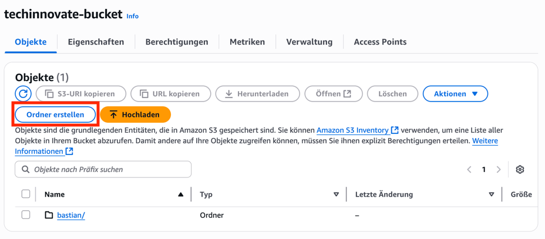
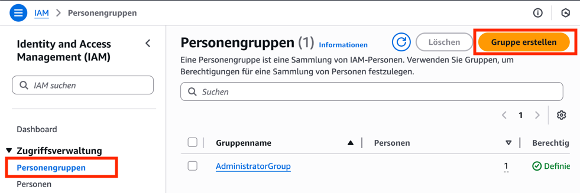
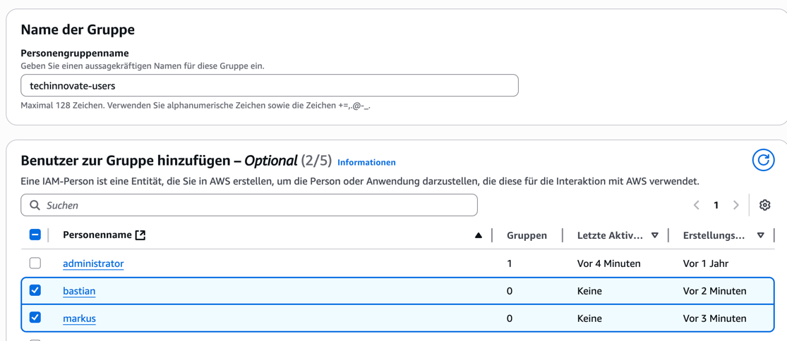
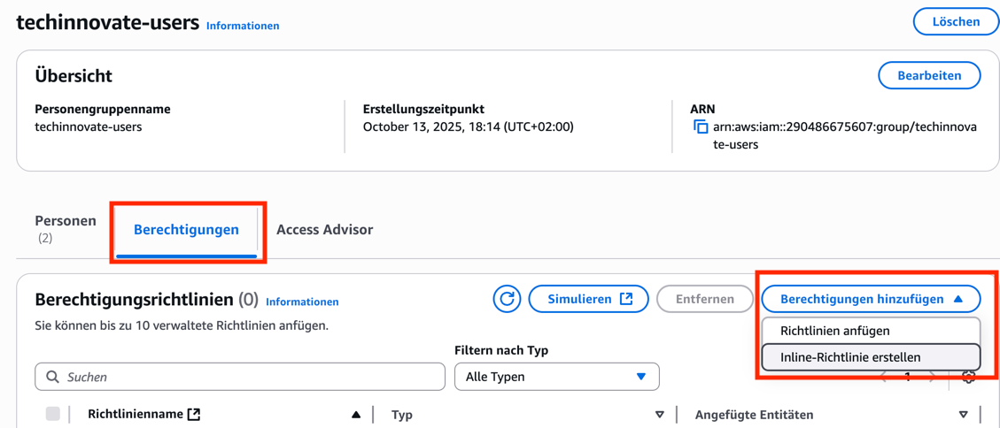
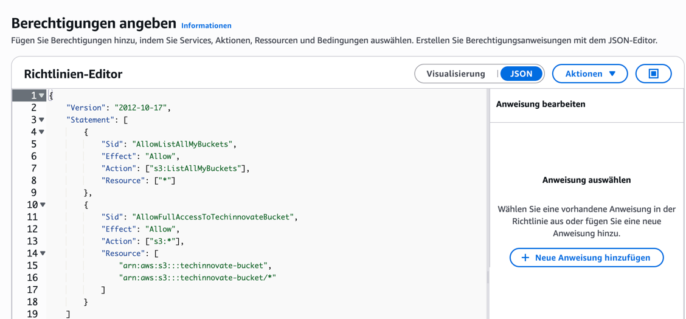
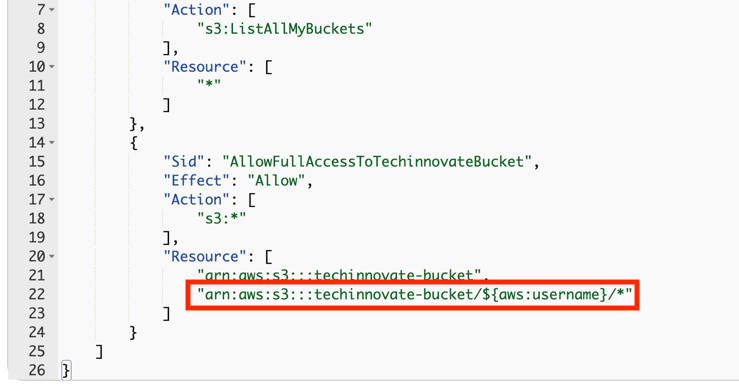

# Aufgaben zu IAM Policies

Stellen Sie sich vor, Sie sind ein neuer AWS IAM-Administrator in einem
Unternehmen namens "TechInnovate". Ihre erste Aufgabe ist es, eine sichere
Umgebung für ein neues Projektteam einzurichten. Das Team soll Zugriff auf einen
S3-Bucket erhalten, um dort ihre Projektdateien zu speichern. Die Teammitglieder
dürfen aber nur ihre eigenen Dateien hochladen, einsehen und löschen, nicht die
von anderen. Sie sollen auch keine Möglichkeit haben, den Bucket selbst zu
löschen oder andere Einstellungen zu ändern.

## Teil 1: Bucket und Benutzer anlegen

Erstellen Sie zunächst einen S3-Bucket mit beliebigem Namen. In dem neuen
S3-Bucket legen Sie zwei Verzeichnisse an: `markus` und `bastian`.

---

Legen Sie außerdem zwei IAM-Benutzer `markus` und `bastian` an. Statten Sie
beide Benutzer mit Konsolen-Zugangsdaten aus, geben Sie ihnen aber keine
Richtlinien.

Legen Sie zudem eine IAM-Gruppe namens `techinnovate-users` an, welche beide
Benutzer – `markus` und `bastian` - enthält.

---

## Teil 2: Policy für grundlegenden Lesezugriff

Damit die Benutzer grundsätzlich die Berechtigung haben, auf den neuen Bucket
zuzugreifen, wollen wir die neue Benutzergruppe mit einer Policy ausstatten.
Öffnen Sie dazu die Detailansicht der Gruppe, wechseln auf den
"Berechtigungen"-Tab und erzeugen danach eine neue Inline-Policy.

---

Wechseln Sie in den JSON-Modus und fügen Sie zwei grundlegende Statements hinzu:

- Erlauben Sie `s3:ListAllMyBuckets` für alle Ressourcen (`*`), damit die
  Konsole alle Buckets des Accounts auflisten kann
- Erlauben Sie vorerst alle S3-Operationen (`s3:*`) sowohl auf den Bucket selbst
  als auch auf alle Objekte im Bucket, den Sie erstellt haben
  (`arn:aws:s3:::BUCKETNAME` sowie `arn:aws:s3:::BUCKETNAME/*`)

Testen Sie, ob die neuen Benutzer nun alle Buckets in der Konsole sehen können
und ausschließlich in dem neuen Bucket Objekte lesen und schreiben können.

## Teil 3: Principal of Least Privilege

Ihre Aufgabe ist es nun, die notwendigen IAM-Richtlinien so zu konfigurieren,
dass jedes Teammitglied **genau** die Berechtigungen erhält, die es benötigt,
und keinen Zugriff auf die Daten der anderen Teammitglieder hat. Sie müssen das
Prinzip der **geringsten Privilegien** ("Least Privilege") strikt anwenden.

Aktuell dürfen beide Benutzer noch auf alle Objekte des Buckets zugreifen. Um
dies anzupassen, müssen Sie das zweite Statement aus der letzten Aufgabe ändern.
Wurde da zuletzt noch der Zugriff auf `arn:aws:s3:::BUCKETNAME` sowie
`arn:aws:s3:::BUCKETNAME/*` erlaubt, so verwenden wir nun eine sogenannte
Policy-Variable, um nicht alle Objekte freizugeben. Ersetzen Sie den zweiten
Eintrag durch `arn:aws:s3:::IHR_BUCKET/${aws:username}/*`.

## Test

Melden Sie sich als `markus` an und versuchen Sie, eine Datei in
`s3://IHR_BUCKET/markus/` hochzuladen. Stellen Sie sicher, dass dies
funktioniert. Versuchen Sie anschließend, eine Datei in
`s3://IHR_BUCKET/bastian/` hochzuladen. Dies sollte **fehlschlagen** und eine
"Access Denied"-Meldung ausgeben.
