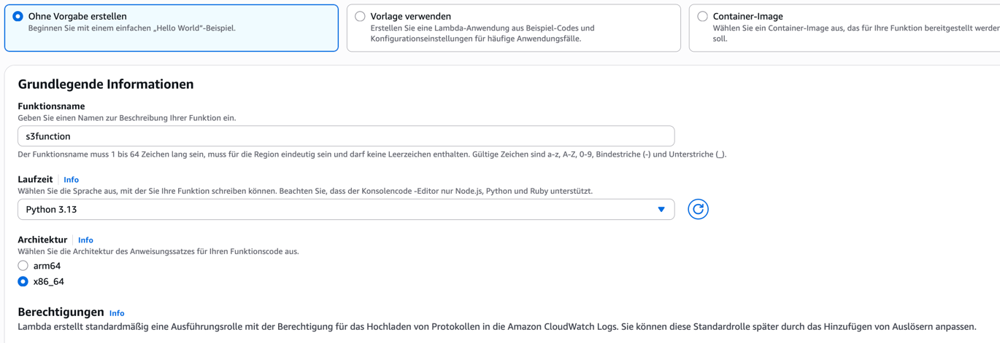
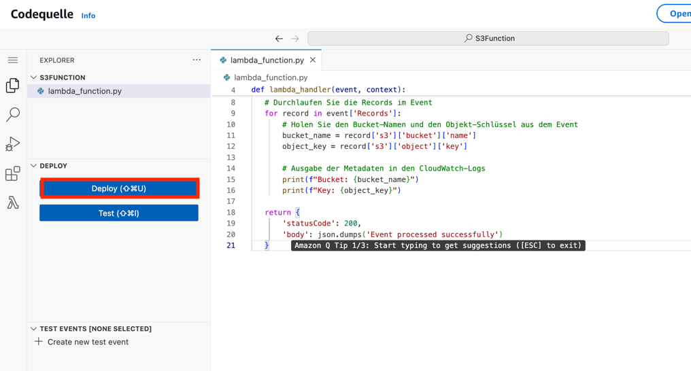
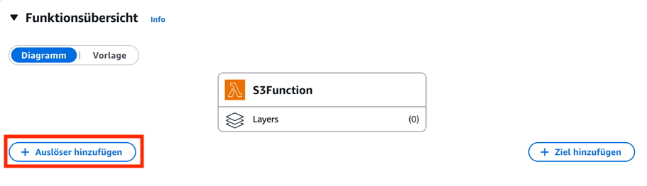
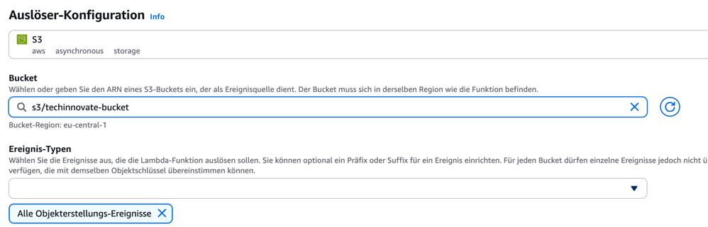
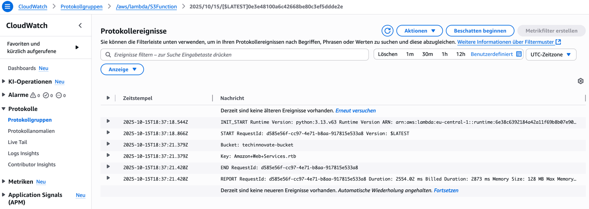
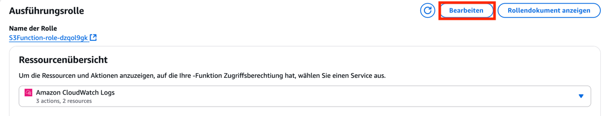

# Aufgaben zu AWS Lambda

## Aufgabe 1: Erstellen und Auslösen einer AWS Lambda-Funktion durch ein S3-Ereignis

### Erstellen einer neuen Lambda-Funktion
- Melden Sie sich bei der AWS Management Console an und öffnen Sie den Lambda-Service.
- Klicken Sie auf "Funktion erstellen".
- Wählen Sie "Ohne Vorgabe erstellen".
- Geben Sie der Funktion einen Namen, z.B. "S3EventFunction".
- Wählen Sie unter "Laufzeit" den Wert "Python 3.13"
- Klicken Sie auf "Funktion erstellen"



### Schreiben des Funktionscodes
- Im Abschnitt "Code" fügen Sie folgenden Code in den Editor ein:

```python
import json
import boto3

def lambda_handler(event, context):
   # Initialisieren Sie den S3-Client
   s3 = boto3.client('s3')

   # Durchlaufen Sie die Records im Event
   for record in event['Records']:
       # Holen Sie den Bucket-Namen und den Objekt-Schlüssel aus dem Event
       bucket_name = record['s3']['bucket']['name']
       object_key = record['s3']['object']['key']

       # Ausgabe der Metadaten in den CloudWatch-Logs
       print(f"Bucket: {bucket_name}")
       print(f"Key: {object_key}")

   return {
       'statusCode': 200,
       'body': json.dumps('Event processed successfully')
   }
```

**Vorsicht: Python ist whitespace sensitive!**



Klicken Sie danach auf "Deploy"

### S3-Bucket erstellen
- Gehen Sie zur S3-Konsole.
- Erstellen Sie einen neuen S3-Bucket mit beliebigem Namen

### Ereignisquelle hinzufügen
- Wechseln Sie wieder in der Web-Konsole in Ihre Lambda-Funktion
- Klicken Sie in der Funktionsübersicht auf "Auslöser hinzufügen"
- Wählen Sie "S3" als Trigger-Typ.
- Wählen Sie den zuvor erstellten S3-Bucket aus.
- Wählen Sie "Alle Objekterstellungsereignisse" als Ereignis-Typ.
- Klicken Sie auf "Hinzufügen".





### Test
- Laden Sie eine neue Datei in den S3-Bucket hoch.
- In der Lambda-Konsole wechseln Sie auf den Reiter "Überwachen".
- Klicken Sie auf "Cloudwatch-Protokolle anzeigen".
- Wählen Sie im "Log streams"-Bereich den neuesten (obersten) Log stream aus und prüfen Sie, ob ein Log für das Objekt erscheint.

- 

## Aufgabe 2: Funktion Zugriff auf S3-Bucket geben

### IAM-Rolle anpassen
- Wechseln Sie auf den "Konfiguration"-Tab.
- Wählen Sie den Reiter "Berechtigungen" aus.
- Klicken Sie auf Link, der zur Rolle führt



- Fügen Sie der Rolle die Policy "AmazonS3FullAccess" hinzu

### Funktionscode anpassen
- Wechseln Sie zurück in die Lambda-Konsole Ihrer Funktion.
- Im Reiter "Code", ändern Sie den Funktionscode wie folgt:

```python
import json
import boto3

def lambda_handler(event, context):
   # Initialisieren Sie den S3-Client
   s3 = boto3.client('s3')

   # Durchlaufen Sie die Records im Event
   for record in event['Records']:
       # Holen Sie den Bucket-Namen und den Objekt-Schlüssel aus dem Event
       bucket_name = record['s3']['bucket']['name']
       object_key = record['s3']['object']['key']

       # Holen Sie die Metadaten des Objekts
       response = s3.head_object(Bucket=bucket_name, Key=object_key)

       # Extrahieren Sie die relevanten Metadaten
       metadata = response['Metadata']
       size = response['ContentLength']
       content_type = response['ContentType']

       # Ausgabe der Metadaten in den CloudWatch-Logs
       print(f"Bucket: {bucket_name}")
       print(f"Key: {object_key}")
       print(f"Size: {size} bytes")
       print(f"Content-Type: {content_type}")
       print(f"Metadata: {json.dumps(metadata)}")

   return {
       'statusCode': 200,
       'body': json.dumps('Event processed successfully')
   }
```

### Bereitstellen
- Klicken Sie auf "Deploy".

### Test
- Laden Sie eine neue Datei in den S3-Bucket hoch.
- In der Lambda-Konsole wechseln Sie auf den Reiter "Überwachen".
- Klicken Sie auf "Cloudwatch-Protokolle anzeigen".
- Wählen Sie im "Log streams"-Bereich den neuesten (obersten) Log stream aus und prüfen Sie, ob ein Log für das Objekt erscheint.
